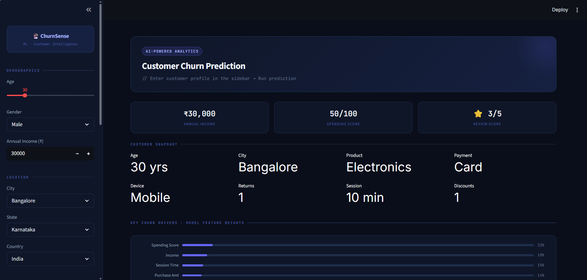
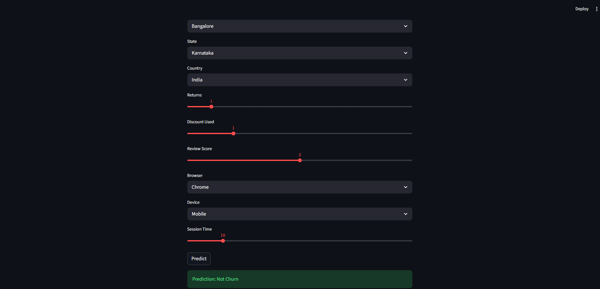

# 📊 Customer Churn Prediction System

## 📌 Project Overview

Customer retention is critical for business growth and profitability. This project leverages Machine Learning techniques to predict whether a customer is likely to churn based on demographic, behavioral, and transaction-related data.

The solution includes an end-to-end machine learning pipeline covering data preprocessing, feature engineering, model training, evaluation, model selection, and deployment through an interactive Streamlit web application.

---

## 🎯 Objectives

* Predict customer churn using historical customer data.
* Identify customers at risk of leaving.
* Support proactive customer retention strategies.
* Compare multiple machine learning algorithms and select the best-performing model.
* Deploy a user-friendly prediction interface using Streamlit.

---

## 🛠️ Technologies Used

### Programming Language

* Python

### Libraries & Frameworks

* Pandas
* NumPy
* Scikit-Learn
* Matplotlib
* Seaborn
* Streamlit
* Pickle

### Machine Learning Algorithms

* Logistic Regression
* K-Nearest Neighbors (KNN)
* Naive Bayes
* Support Vector Machine (SVM)
* Decision Tree
* Random Forest

---

## 📂 Project Structure

```bash
Customer-Churn-Prediction/
│
├── churn prediction.csv
├── train_churn.py
├── churn_model.pkl
├── app_churn.py
├── screenshots/
│   ├── dashboard.png
│   └── prediction_result.png
│
└── README.md
```

---

## 📊 Dataset Features

The dataset contains customer demographic, behavioral, and transactional information, including:

* Age
* Gender
* Income
* Spending Score
* Purchase Amount
* Product Category
* Payment Method
* City
* State
* Country
* Returns
* Discount Used
* Review Score
* Browser
* Device Type
* Session Time
* Last Purchase Date

### Target Variable

* Churn

  * 1 → Customer Churned
  * 0 → Customer Retained

---

## ⚙️ Machine Learning Workflow

### 1. Data Preprocessing

* Removed duplicate records
* Handled missing values
* Standardized data formats
* Converted date fields into numerical features

### 2. Feature Engineering

* Created Days Since Last Purchase feature
* Encoded categorical variables
* Scaled numerical features

### 3. Model Training

The following algorithms were trained and evaluated:

* Logistic Regression
* KNN
* Naive Bayes
* SVM
* Decision Tree
* Random Forest

### 4. Model Evaluation

Models were compared using:

* Accuracy
* Precision
* Recall
* F1 Score

The best-performing model was automatically selected and saved for deployment.

---

## 🚀 Streamlit Application

The project includes an interactive Streamlit application where users can:

* Enter customer information
* Adjust behavioral metrics
* Generate churn predictions instantly
* Identify customers likely to leave

### Input Parameters

* Age
* Gender
* Income
* Spending Score
* Purchase Amount
* Product Category
* Payment Method
* Location Details
* Customer Returns
* Discount Usage
* Review Score
* Browser & Device Type
* Session Duration

### Output

* Churn
* Not Churn

---

## 📈 Business Value

This solution helps organizations:

* Reduce customer attrition
* Improve customer retention strategies
* Identify high-risk customers
* Increase customer lifetime value
* Support data-driven decision-making

Industries that can benefit include:

* E-Commerce
* Retail
* Banking
* Telecommunications
* Subscription-Based Services

---

## ▶️ How to Run the Project

### Clone Repository

```bash
git clone https://github.com/yourusername/customer-churn-prediction.git
cd customer-churn-prediction
```

### Install Dependencies

```bash
pip install -r requirements.txt
```

### Train Model

```bash
python train_churn.py
```

### Launch Streamlit App

```bash
streamlit run app_churn.py
```

---

## 📸 Application Preview

### Customer Input Interface



### Prediction Result



---

## 💡 Skills Demonstrated

* Machine Learning
* Classification Modeling
* Data Cleaning
* Feature Engineering
* Exploratory Data Analysis (EDA)
* Model Evaluation
* Streamlit Deployment
* Business Analytics
* Customer Retention Analytics

---

## 👨‍💻 Author

**Mallareddygari Gayathri**

Data Analyst | Data Science Enthusiast | Machine Learning Engineer

---

## ⭐ Support

If you found this project useful, consider giving it a Star ⭐ and sharing your feedback.
